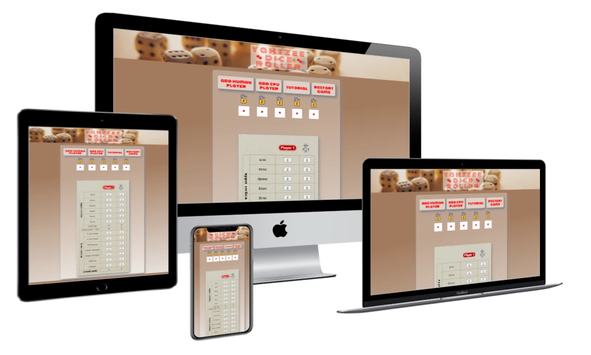
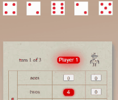
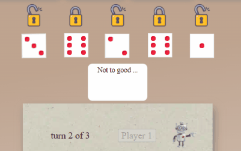
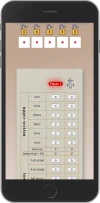
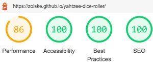
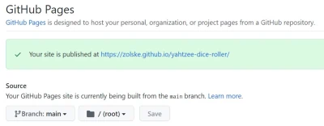

#  Yahtzee Dice Roller

The user can play a game of Yahtzee with a friend on the same machine or against the computer. A tutorial provides instructions on how the game works on this site and the Yahtzee game rules in general.

[link to the "Yahtzee Dice Roller" site](https://zolske.github.io/yahtzee-dice-roller/)  
**TIP!** _>>> press **CTRL** while clicking on a link opens the page in a new tab <<<_ **TIP!**

---

## Features

### Existing Features:

- **quick and easy game set up**

  

  - **"add human player"**
    - add as many players as you like _(to be played **manually** on one machine)_
  - **"add cpu player"**
    - add as many players as you like _(to be played by the **computer**)_
  - **"tutorial"**
    - explains how the game works on this site and the rules of Yahtzee
  - **"restart game"**
    - clears the the "game table" for a new game

- **player name**

  

  - individual names can be given to the players
  - JavaScript is checking that the same name can not be used twice

- **"game-logic"**

  

  - the possible choices which the play has are highlighted by the "game-logic"  
    _(you can see in the image above, that "Player 1" rolled two twos but no ones. The "game-logic" highlighted 4 points in "twos" but no "ones".)_
  - the player is guided through flashing-buttons (e.g. next player and where he can write points)
  - you can see a diagram of the game logic by clicking on this link -> [game logic](assets/doc/Control-Flow-Graph-drawio.md)

- **"cpu player"**

   

  - makes decisions which dices to roll and where to write the points
  - communicates with the human player via text and sound

- **see what the computer is doing**

  

  - with the chrome "dev tool" _(F12)_ the console can be opened in which the "player-object" and some important values are displayed while the cpu is playing
  - clicking on this link -> [JavaScript game logic](assets/doc/Control-Flow-Graph-drawio.md)

- **intuitive game design**

  

  - easy to understand symbols make the game accessible to a wide variety of players

- **tutorial**
  - explains how the game works
  - explains the Yahtzee game rules
  - easy to navigate through a navigation bar which sticks to the top of the screen
- **"mobile first" design**

  

  - can be easily played on a smart phone with a big screen
  - buttons have been given enough spaced to avoid mistakes
  - only up and down scrolling _(only side scrolling if there are more than three players set up)_

### Features Left to Implement:

- adding a setting menu, to customize user profile, dice color, theme
- adding a data base would allow the user to save there profile and high score
- increase sites "Lighthouse" performers by minimizing **"Cumulative Layout Shift"**,

---

## **U**ser **C**entric **D**esign

Please, follow [this link](assets/doc/ucd.md) for the **"customer story"** and **"user experience"**.

---

## **Control Flow Graph** for the JavaScript logic

Please, have a look at the diagram for the JavaScript game logic!  
clicking on this link -> [JavaScript game logic](assets/doc/Control-Flow-Graph-drawio.md)

---

## Testing

1. ### Browser Testing:

   - functionality- and layout- tests where successful on: **"Chrome"**, **"Mozilla Firefox"** and **"Microsoft Edge"**
   - because the tester has no access to **"Safari"**, the site was not tested on that browser

2. ### Validator Testing

   - **HTML** [**Nu Html Checker**](https://validator.w3.org/nu/?doc=https%3A%2F%2Fzolske.github.io%2Fyahtzee-dice-roller%2F) :
     - test returned clean, **NO ERRORS** or warnings
   - **CSS** [**Jigsaw Test**](https://jigsaw.w3.org/css-validator/validator?uri=https%3A%2F%2Fzolske.github.io%2Fyahtzee-dice-roller%2F&profile=css3svg&usermedium=all&warning=1&vextwarning=&lang=en) :
     - the document validates as CSS level 3 + SVG !
     - test returned clean, **NO ERRORS** and 28 warnings which are related to "safari" and "Mozilla" code _(e.g. -webkit-border-radius, -moz-animation)_
       

       
       
       

   - **JavaScript** [**JSHint**](https://jshint.com/) :  
      _(**config:** New JavaScript features (ES6): **ON** | Unused variables: **OFF** )_  
      _(JavaScript is split into 3 flies, to improve maintainability and readability. **Unused variable** option is turned off for the test because functions are **imported** between files and variable could be used during runtime.)_

     - **script.js** _(base script)_
       - **NO ERRORS** and no warnings
       - There are **4 functions** in this file.
       - Function with the largest signature take 1 arguments, while the median is 0.
       - **Largest function** has **2 statements** in it, while the median is 1.
       - The most complex function has a cyclomatic complexity value of 2 while the median is 1.
     - **function.js** _(containing all the code for the base game)_
       - **NO ERRORS** and 6 warnings
       - There are **28 functions** in this file.
       - Function with the largest signature take 2 arguments, while the median is 1.
       - **Largest function** has **206 statements** in it, while the median is 6.
       - The most complex function has a cyclomatic complexity value of 60 while the median is 2.
     - **cpu.js** _(containing all the code for the "computer" player)_
       - **NO ERRORS** and 12 warnings
       - There are **106 functions** in this file.
       - Function with the largest signature take 3 arguments, while the median is 0.
       - **Largest function** has **49 statements** in it, while the median is 1.
       - The most complex function has a cyclomatic complexity value of 109 while the median is 1

     **NOTE:** All 18 warnings are related to semantics, but they are necessary for the script to function correctly _( "Functions declared within loops referencing an outer scoped variable **may lead to confusing semantics**. (i)" )_

3. ### Performance Test
   - **Lighthouse** _(desktop)_ report:  
      
     - the **performance** could be improved by minimizing **"Cumulative Layout Shift"**,  
       link to article -> [smashingmagazine](https://www.smashingmagazine.com/2021/06/how-to-fix-cumulative-layout-shift-issues/)

---

## Unfixed Bugs

- ### dice does not turn:
  - The animation for the dices is triggered after a random number (between 1-6) for each of the (unlocked) dices has been generated. The **"class"** of the dice changes, which triggers the animation and determines the shown number _(e.g. "class="show-1" will show the dice with one dot)_.  
    The bug happens when the same number is randomly generated as already shown on the dice. _(e.g. one is the starting number and one is shown again)_
- ### dice from previous player can be locked:
  - It is possible to cheat by locking the **"lock"** on the dices after the previews player has finished there turn  
    _(e.g. the previous player has rolled an "Yahtzee", now I could lock the dices before I start to roll)_

---

## Technologies used

- **HTML** for marking up the text elements on the site
- **CSS** for styling the site
- **JavaScript** for functionality and logic
- **Git** for version control (back up)
- **GitHub** for making the source code accessible and deploying the site via "GitHub Pages"

---

## Deployment

The site was deployed to **"GitHub Pages"**. The steps to deploy are as follows:

1. In the GitHub repository, navigate to the **"Settings"** tab.
2. In the "Settings" tab, navigate to the **"Pages"** tab.
3. In the section "GitHub Pages":

   - From the **"Source"** section drop-down menu, select the **"main"** Branch and click on **"Save"**
   - above a message appears "Your site is published at ... " with the link to the GitHub Page

     

The live link to the "Yahtzee Dice Roller" GitHub Page can be found  
here -> [https://zolske.github.io/yahtzee-dice-roller/](https://zolske.github.io/yahtzee-dice-roller/) .

---

## Credits

I would like to thank the creators of the free tools, art and tutorials which have made this site possible.

### Content

- the code for the **dice animation** is based on  
  Lena Stanleys [Roll the dice!](https://lenadesign.org/2020/06/18/roll-the-dice/) and  
  CHRIS GODBER [How to Create 3D Rolling Dice with CSS and JavaScript](https://icodemag.com/3d-rolling-dice-css-javascript/)
- the **Yahtzee game rules** for the tutorial are from [Ultra Board Games](https://www.ultraboardgames.com/yahtzee/game-rules.php)
- the **flashing button animation** is from [Muhammad Arslan Aslam
  ](https://codepen.io/arximughal) and his code can be found on [codepen](https://codepen.io/arximughal/pen/LEpoOJ)
- the **robot ".gif"** is from ["Graphic Mama"](https://graphicmama.com/blog/free-gifs-powerpoint/)
- the **emojis** are from [html-css-js](https://html-css-js.com/html/character-codes/)
- **"tutorial navbar"** is based on the code from [w3schools](https://www.w3schools.com/howto/howto_css_dropdown_navbar.asp)
- the **font** for the heading is "Monoton" and was created by **"Vernon Adams"** _(you can follow him on [sansoxygen](http://sansoxygen.com/))_

### Tools

- **code editing** was done with [vscode](https://code.visualstudio.com/)
- **the sound** was downloaded from [mixkit](https://mixkit.co/free-sound-effects/robot/)
- **the logo** was created with [freelogodesign](https://www.freelogodesign.org/)
- **the favicon** was converted with [favicon](https://favicon.io/favicon-converter/)
- **the wireframe** was done with [figma](https://www.figma.com/)
- **the images** are from ...
  - ... [unsplash](https://unsplash.com/) and
  - ... [pixelbay](https://pixabay.com/)
- **the color palette** was created with [coolors](https://coolors.co/)
- **the gradients** where coded with [cssgradient](https://cssgradient.io/)
- **icons** are from [flaticon](https://www.flaticon.com/)
- **the sprite** has been made with [Responsive CSS Sprites](https://responsive-css.spritegen.com/)
- **the gif** was created with [Screen to Gif](https://www.screentogif.com/)
- **the mock up** was created with [techsini](http://techsini.com/multi-mockup/index.php)
- **the font** was imported from [Fonts Google](https://fonts.google.com/)
- **control flow graph** was created with [diagrams](https://www.diagrams.net/)

### Tutorials

- [**w3schools**](https://www.w3schools.com/html/default.asp) Very good site to look things up for a basic explanation. They have also a very good section where components are shown and explained [How To ...](https://www.w3schools.com/howto/default.asp)
- [**MDN Web Docs**](https://developer.mozilla.org/en-US/docs/Web/JavaScript/Reference) Very technical explanation.
- [**Coding with Mosh**](https://codewithmosh.com/courses) Very good video tutorials, no time waster, straight to the point!

### Special Thank You to ...

- [**Code Institute**](https://codeinstitute.net/5-day-coding-challenge/?utm_term=code%20institute&utm_campaign=CI+-+UK+-+Search+-+Brand&utm_source=adwords&utm_medium=ppc&hsa_acc=8983321581&hsa_cam=1578649861&hsa_grp=62188641240&hsa_ad=486298911546&hsa_src=g&hsa_tgt=kwd-319867646331&hsa_kw=code%20institute&hsa_mt=e&hsa_net=adwords&hsa_ver=3&gclid=Cj0KCQiAieWOBhCYARIsANcOw0xDHa3f_LBureuUJS8cxQbxsG36sK6ZafAQHaKmIEky_0bbH2qv0FQaAp2qEALw_wcB) for providing me with the learning materials and student support.
- [**Spencer Barriball**](https://5pence.net/) my Mentor. Thank you for your advise and support. _(especially for the [article on JavaScript promises](https://5pence.net/javascript-promise-overview/))_
