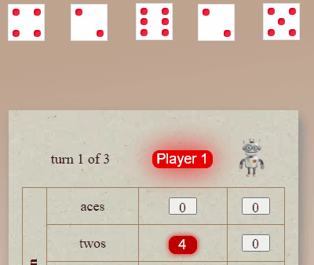
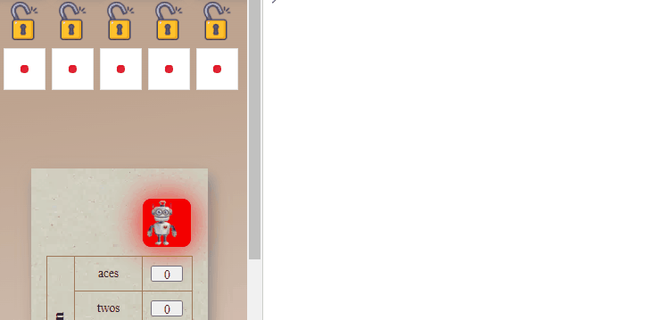
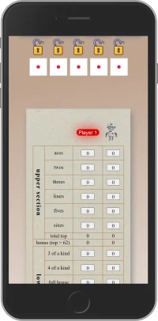

#  Yahtzee Dice Roller

The user can play a game of Yahtzee with a friend on the same machine or against the computer. A tutorial provides instructions on how the game works on this site and the Yahtzee game rules in general.

[link to the "Yahtzee Dice Roller" site](https://zolske.github.io/yahtzee-dice-roller/)

---

## Features

### Existing Features:

- **quick and easy game set up**  
  
  - **"add human player"**
    - add as many players as you like _(to be played **manually** on one machine)_
  - **"add cpu player"**
    - add as many players as you like _(to be played by the **computer**)_
  - **"tutorial"**
    - explains how the game works on this site and the rules of Yahtzee
  - **"restart game"**
    - clears the the "game table" for a new game
- **player name**  
  
  - individual names can be given to the players
  - JavaScript is checking that the same name can not be used twice
- **"game-logic"**  
  
  - the possible choices which the play has are highlighted by the "game-logic"  
    _(you can see in the image above, that "Player 1" rolled two twos but no ones. The "game-logic" highlighted 4 points in "twos" but no "ones".)_
  - the player is guided through flashing-buttons (e.g. next player and where he can write points)
- **"cpu player"**  
   
  - makes decisions which dices to roll and where to write the points
  - communicates with the human player via text and sound
- **see what the computer is doing**
  
  - with the chrome "dev tool" _(F12)_ the console can be opened in which the "player-object" and some important values are displayed while the cpu is playing
- **intuitive game design**  
  
  - easy to understand symbols make the game accessible to a wide variety of players
- **tutorial**
  - explains how the game works
  - explains the Yahtzee game rules
  - easy to navigate through a navigation bar which sticks to the top of the screen
- **"mobile first" design**  
  
  - can be easily played on a smart phone with a big screen
  - buttons have been given enough spaced to avoid mistakes
  - only up and down scrolling _(only side scrolling if there are more than three players set up)_

---

## Testing

---

### Validator Testing

---

## Unfixed Bugs

---

## Deployment

---

## Credits

- the code for the **dice animation** is based on  
  Lena Stanleys [Roll the dice!](https://lenadesign.org/2020/06/18/roll-the-dice/) and  
  CHRIS GODBER [How to Create 3D Rolling Dice with CSS and JavaScript](https://icodemag.com/3d-rolling-dice-css-javascript/)

### Tools

- **the logo** was created with [freelogodesign](https://www.freelogodesign.org/)
- **the favicon** was converted with [favicon](https://favicon.io/favicon-converter/)
- **the wireframe** was done with [figma](https://www.figma.com/)
- **the images** are from ...
  - ... [unsplash](https://unsplash.com/) and
  - ... [pixelbay](https://pixabay.com/)
- **the color palette** was created with [coolors](https://coolors.co/)
- **the gradients** where coded with [cssgradient](https://cssgradient.io/)
- **icons** are from [flaticon](https://www.flaticon.com/)
