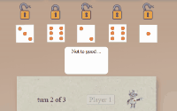

#  Yahtzee Dice Roller

The user can play a game of Yahtzee with a friend on the same machine or against the computer. A tutorial provides instructions on how the game works on this site and the Yahtzee game rules in general.

[link to the "Yahtzee Dice Roller" site](https://zolske.github.io/yahtzee-dice-roller/) _(press **CTRL** while clicking on the link opens a new tab)_

---

## Features

### Existing Features:

- **quick and easy game set up**

  

  - **"add human player"**
    - add as many players as you like _(to be played **manually** on one machine)_
  - **"add cpu player"**
    - add as many players as you like _(to be played by the **computer**)_
  - **"tutorial"**
    - explains how the game works on this site and the rules of Yahtzee
  - **"restart game"**
    - clears the the "game table" for a new game

- **player name**

  

  - individual names can be given to the players
  - JavaScript is checking that the same name can not be used twice

- **"game-logic"**

  

  - the possible choices which the play has are highlighted by the "game-logic"  
    _(you can see in the image above, that "Player 1" rolled two twos but no ones. The "game-logic" highlighted 4 points in "twos" but no "ones".)_
  - the player is guided through flashing-buttons (e.g. next player and where he can write points)

- **"cpu player"**

   

  - makes decisions which dices to roll and where to write the points
  - communicates with the human player via text and sound

- **see what the computer is doing**

  

  - with the chrome "dev tool" _(F12)_ the console can be opened in which the "player-object" and some important values are displayed while the cpu is playing

- **intuitive game design**

  

  - easy to understand symbols make the game accessible to a wide variety of players

- **tutorial**
  - explains how the game works
  - explains the Yahtzee game rules
  - easy to navigate through a navigation bar which sticks to the top of the screen
- **"mobile first" design**

  

  - can be easily played on a smart phone with a big screen
  - buttons have been given enough spaced to avoid mistakes
  - only up and down scrolling _(only side scrolling if there are more than three players set up)_

### Features Left to Implement:

- adding a setting menu, to customize user profile, dice color, theme
- adding a data base would allow the user to save there profile and high score

---

## Testing

### Browser Testing:

- functionality- and layout- tests where successful on: _"Chrome"_, _"Mozilla Firefox"_ and _"Microsoft Edge"_
- because the tester has no access to _"Safari"_, the site was not tested on that browser

---

### Validator Testing

- **HTML** [**Nu Html Checker**](https://validator.w3.org/nu/?doc=https%3A%2F%2Fzolske.github.io%2Fyahtzee-dice-roller%2F) :
  - test returned clean, no errors or warnings
- **CSS** [**Jigsaw Test**](https://jigsaw.w3.org/css-validator/validator?uri=https%3A%2F%2Fzolske.github.io%2Fyahtzee-dice-roller%2F&profile=css3svg&usermedium=all&warning=1&vextwarning=&lang=en) :
  - the document validates as CSS level 3 + SVG !
  - test returned clean, no errors and 28 warnings which are related to "safari" and "Mozilla" code _(e.g. -webkit-border-radius, -moz-animation)_
  

  
  
  

---

## Unfixed Bugs

- ### dice does not turn:
  - The animation for the dices is triggered after a random number (between 1-6) for each of the (unlocked) dices has been generated. The **"class"** of the dice changes, which triggers the animation and determines the shown number _(e.g. "class="show-1" will show the dice with one dot)_.  
    The bug happens when the same number is randomly generated as already shown on the dice. _(e.g. one is the starting number and one is shown again)_
- ### dice from previous player can be locked:
  - It is possible to cheat by locking the **"lock"** on the dices after the previews player has finished there turn  
    _(e.g. the previous player has rolled an "Yahtzee", now I could lock the dices before I start to roll)_

---

## Deployment

The site was deployed to **"GitHub pages"**. The steps to deploy are as follows:

1. In the GitHub repository, navigate to the **"Settings"** tab.
2. In the "Settings" tab, navigate to the **"Pages"** tab.
3. In the section "GitHub Pages":

   - From the **"source"** section drop-down menu, select the **"Main"** Branch and click on **"Save"**
   - above a message appears "Your site is published at ... " with the link to the GitHub page

     

The live link to the "Yahtzee Dice Roller" GitHub page can be found here -> [https://zolske.github.io/yahtzee-dice-roller/](https://zolske.github.io/yahtzee-dice-roller/) .

---

## Credits

I would like to thank the creators of the free tools, art and tutorials which have made this site possible.

### Content

- the code for the **dice animation** is based on  
  Lena Stanleys [Roll the dice!](https://lenadesign.org/2020/06/18/roll-the-dice/) and  
  CHRIS GODBER [How to Create 3D Rolling Dice with CSS and JavaScript](https://icodemag.com/3d-rolling-dice-css-javascript/)
- the **Yahtzee game rules** for the tutorial are from [Ultra Board Games](https://www.ultraboardgames.com/yahtzee/game-rules.php)
- the **flashing button animation** is from [Muhammad Arslan Aslam
  ](https://codepen.io/arximughal) and his code can be found on [codepen](https://codepen.io/arximughal/pen/LEpoOJ)
- the **robot ".gif"** is from ["Graphic Mama"](https://graphicmama.com/blog/free-gifs-powerpoint/)
- the **emojis** are from [html-css-js](https://html-css-js.com/html/character-codes/)
- **"tutorial navbar"** is based on the code from [w3schools](https://www.w3schools.com/howto/howto_css_dropdown_navbar.asp)

### Tools

- **the sound** was downloaded from [mixkit](https://mixkit.co/free-sound-effects/robot/)
- **the logo** was created with [freelogodesign](https://www.freelogodesign.org/)
- **the favicon** was converted with [favicon](https://favicon.io/favicon-converter/)
- **the wireframe** was done with [figma](https://www.figma.com/)
- **the images** are from ...
  - ... [unsplash](https://unsplash.com/) and
  - ... [pixelbay](https://pixabay.com/)
- **the color palette** was created with [coolors](https://coolors.co/)
- **the gradients** where coded with [cssgradient](https://cssgradient.io/)
- **icons** are from [flaticon](https://www.flaticon.com/)
- **the sprite** has been made with [Responsive CSS Sprites](https://responsive-css.spritegen.com/)
- **the gif** was created with [Screen to Gif](https://www.screentogif.com/)

### Tutorials

- [**w3schools**](https://www.w3schools.com/html/default.asp) Very good site to look things up for a basic explanation. They have also a very good section where components are shown and explained [How To ...](https://www.w3schools.com/howto/default.asp)
- [**MDN Web Docs**](https://developer.mozilla.org/en-US/docs/Web/JavaScript/Reference) Very technical explanation.
- [**Coding with Mosh**](https://codewithmosh.com/courses) Very good video tutorials, no time waster, straight to the point!

### Special Thank you to ...

- [**Code Institute**](https://codeinstitute.net/5-day-coding-challenge/?utm_term=code%20institute&utm_campaign=CI+-+UK+-+Search+-+Brand&utm_source=adwords&utm_medium=ppc&hsa_acc=8983321581&hsa_cam=1578649861&hsa_grp=62188641240&hsa_ad=486298911546&hsa_src=g&hsa_tgt=kwd-319867646331&hsa_kw=code%20institute&hsa_mt=e&hsa_net=adwords&hsa_ver=3&gclid=Cj0KCQiAieWOBhCYARIsANcOw0xDHa3f_LBureuUJS8cxQbxsG36sK6ZafAQHaKmIEky_0bbH2qv0FQaAp2qEALw_wcB) for providing me with the learning materials and student support.
- [**Spencer Barriball**](https://5pence.net/) my Mentor. Thank you for your advise and support. _(especially for the [article on JavaScript promises](https://5pence.net/javascript-promise-overview/))_
