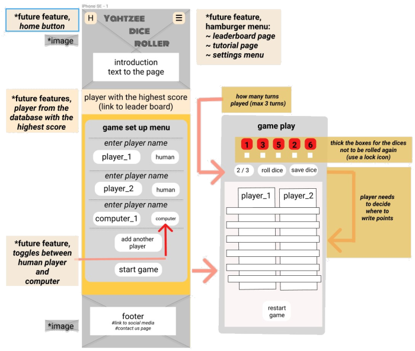
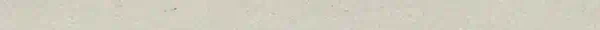

# **U**ser **C**entered **D**esign

_for the website "yahtzee dice roller"_

---

## 1. The **Strategy**

### For who is the website?

- for everyone who wants to have fun playing an easy and quick game

### **What the user want is ...**

1. **... to play a game online**  
   _(is easy accessible and dose not require a download and installation)_

2. **... to play an easy to understand game**  
   _(no complicated rules which require a steep learning curve, a game which he (she) may know already)_

3. **... to relax when playing**  
   _(short game (10 - 15min), not to much decision making required)_

4. **... to have a challenge**  
   _(to play with friends or the computer, set a new high score)_

5. **... to have a different experience when playing the game again**  
   _(every game is different)_

### **What the business side want is ...**

1.  **... attract user**  
    _(by providing a fun experience, user may recommend side to friends to play with them)_
2.  **... keep them engaged**  
    _(every game is different and user can set high score, play with friends or computer)_

---

## 2. The **Scope**

### **Features**

1. playable Yahtzee game
   - five random generated dices
   - a "form" where the points can be noted
   - adding points together to show total score
   - correct rule implementation _(e.g. 3 turns, points must be entered and can not be changed with a better score)_
2. playable with a friend
   - player taking turns playing on the same browser
3. playable against the computer
   - computer follows rules and makes decisions where to enter points

### **Features for future release:**

1. connect to a "high score" data base
   - data exchange with external data base _(ranks highest score)_
2. tutorial
   - explaining the user the rules of the game
3. "settings" menu
   - user can change style of the game / website
4. sound
   - background music
   - when dices are rolling
   - win & lose game melody

---

## 3. The **Structure**

### **Information Architecture** (IA)

sitemap:

1. navigation bar:
   - simple structure
   - main content to be placed on landing page
   - future features to include additional pages / menus which would be included in an hamburger menu on the mobile version
2. footer: - "contact us" page and links to social media
   

---

## 4. The **Skeleton**

This are the initial drafts for the site "Yahtzee Dice Roller".

### mobile wireframe

### desktop wireframe

---

## 5. The **Surface**

### **"Hero Image"**

An image with dices is used to enhance the mood to "roll" the dice. It also helps to convey the purpose of the site.  
The image had to be:

- discreet to not overpower the site but to just set the mood _(low details)_
- "warm" colors _(brown tones)_ to create a relaxing and stress free atmosphere

### **"The Heading"**

An **image of red dices** was added to the heading to emphasize the meaning of the heading. _(perhaps not everyone knows the game "Yahtzee" but the dices suggest it is a game played with dices)_  
The **background** of the heading is semi transparent and white. This was done to increase the contrast and therefore the readability of the heading.

### **"Font"**

  
The font was created by **"Vernon Adams"** _(you can follow him on [sansoxygen](http://sansoxygen.com/))_ which can be imported from here ["Monoton" Google Fonts](https://fonts.google.com/specimen/Monoton#standard-styles) .

_" Monoton is a contemporary take on metalpress fonts like, for example, 'Prisma' (originally designed in 1931 by Rudolf Koch.) "_

I choose the font because it looks like a old style gambling casino font to me. This font is only meant to be for larger headings _(font sizes above 30 points)_ because on smaller sizes the details getting lost.  
_(Note: The font has been used for the "game setting" buttons, even the details are lost, they still look good.)_

### **"Color Schema"**

  
The **over all color schema** features warm colors to create a relaxing and warm atmosphere. It should also imitated wood to create associations with board games made of wood or played on wood _(table)_.

  
The color _(#ff1414)_ red has been used for the headings and buttons font. Variations of the color are used for the flash button animation. _(the color signals importance and draws attention)_

### **"Texture"**

  
A texture is used to simulate paper as table background for the score.  
_(brownish texture has been chosen over white to keep with an warmish color schema)_

### **"Icons"**

  
The meaning of this icon is instantly clear _(lock the dice)_. Hovering over the icon creates an hover effect to indicate that it can be clicked.

### **"Animation"**

  
Flashing button animations guide the user through the game and inform about possible decisions which the user can take.  
_(In this example the user could click on "1" which would end his turn or on "Player 1" to roll the dices again. He can not select the "0" because no "twos" where diced. Note: There is an exception to this rule, if the player has no more turns left and there are no scores which can be entered to the table than he has to "cross out" a score, this buttons are not highlighted.)_
