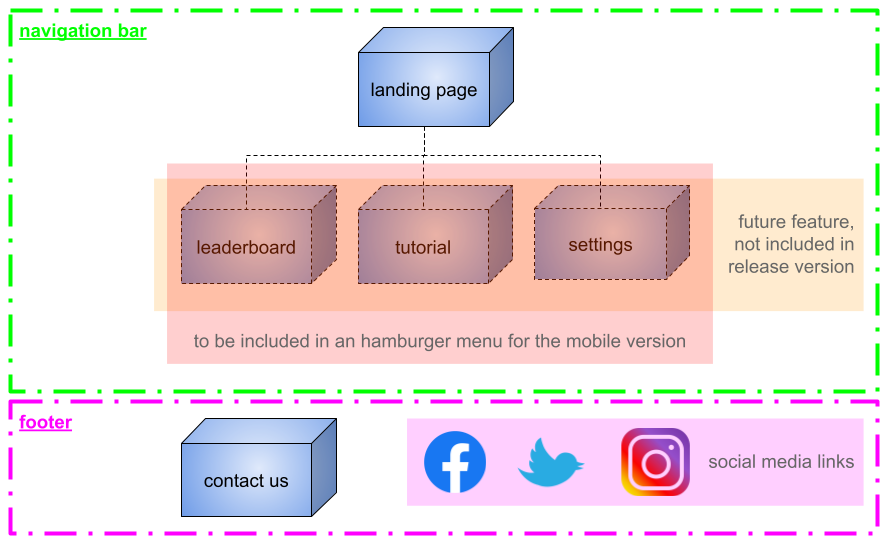

# **U**ser **C**entered **D**esign  
*for the website "yahtzee dice roller"*
***
## 1. The **Strategy**  
### For who is the website?  
- for everyone who wants to have fun playing an easy and quick game  
### **What the user want is ...**  
1. **... to play a game online**  
    *(is easy accessible and dose not require a download and installation)*    
  
2. **... to play an easy to understand game**  
    *(no complicated rules which require a steep learning curve, a game which he (she) may know already)*  
  
3. **... to relax when playing**  
    *(short game (10 - 15min), not to much decision making required)*
  
4. **... to have a challenge**  
    *(to play with friends or the computer, set a new high score)*

5. **... to have a different experience when playing the game again**  
    *(every game is different)*  

### **What the business side want is ...**  
   1. **... attract user**  
    *(by providing a fun experience, user may recommend side to friends to play with them)*
   2. **... keep them engaged**  
   *(every game is different and user can set high score, play with friends or computer)*  

***
## 2. The **Scope**  
### **Features**
1. playable Yahtzee game
    - five random generated dices
    - a "form" where the points can be noted
    - adding points together to show total score
    - correct rule implementation *(e.g. 3 turns, points must be entered and can not be changed with a better score)*
2. playable with a friend
    - player taking turns playing on the same browser
3. playable against the computer
    - computer follows rules and makes decisions where to enter points  
### **Features for future release:**
1. connect to a "high score" data base
    - data exchange with external data base *(ranks highest score)*
2. tutorial
    - explaining the user the rules of the game
3. "settings" menu
    - user can change style of the game / website
4. sound
    - background music
    - when dices are rolling
    - win & lose game melody
***
## 3. The **Structure**  
### **Information Architecture** (IA)  
sitemap:
1. navigation bar:
    - simple structure
    - main content to be placed on landing page
    - future features to include additional pages / menus which would be included in an hamburger menu on the mobile version  
2. footer:
    - "contact us" page and links to social media

***
## 4. The **Skeleton**  
### mobile wireframe
  
### desktop wireframe
  

***
## 5. The **Surface**  

